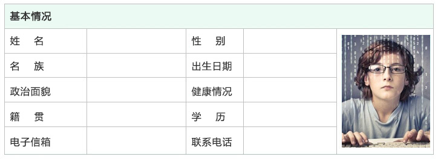
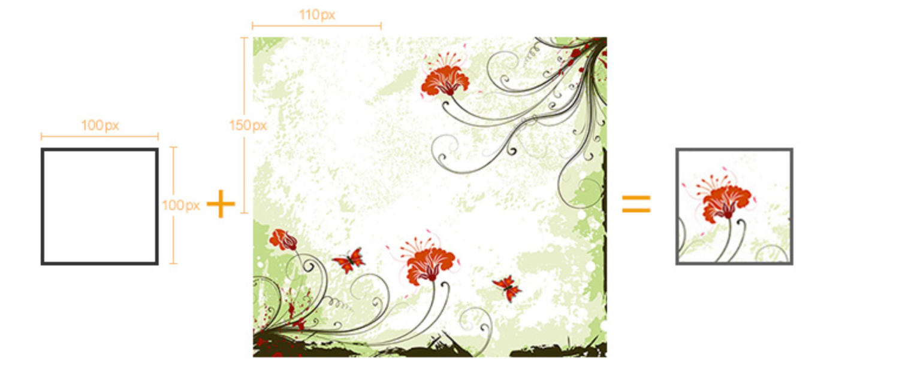
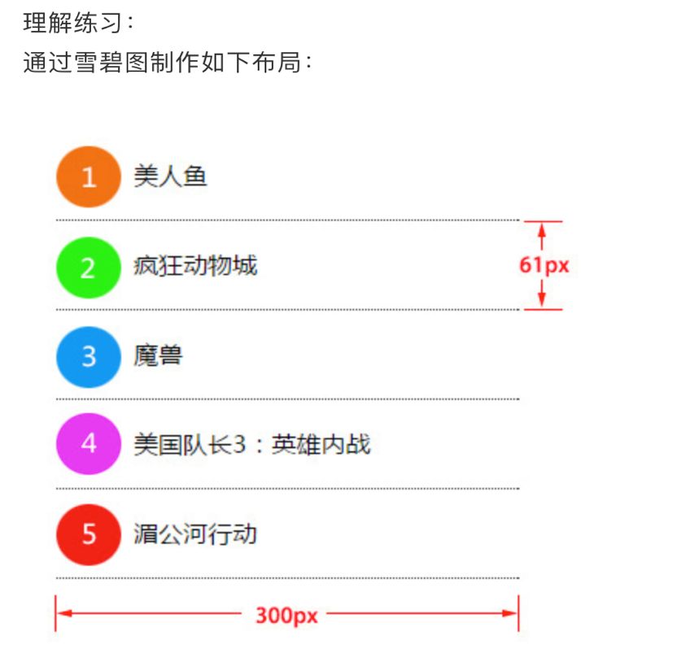

##04-HTML和CSS高级


###00-知识点预习
-	1.表格基本使用
- 	2.选择器权重计算
-  3.背景图片属性
-  4.精灵图
-  5.天天生鲜案例


###01-表格(table)基本使用
```
table:
        tr row 行数
        td description  内容
        th head ;居中 加粗
		 /* 3.合并边框 */
        border-collapse: collapse;
         
        跨列合并: colspan  找到第几行的哪个内容, colspan="几列";多余的删除
        跨行合并: rowspan  找到第几行的那个内容, rowspan = "几行";多余的删除
```

###02-表格案例


###03-选择器权重计算
-	**层级选择器累加权重值**
- **权重较高会覆盖较低的**
- **权重相同时后写的会覆盖前面的**


选择器 |  权重值
---|---
1.标签    |    1
2.类      |   10
3.ID      |   100
4.行内式    | 1000
5.!important  |10000       **提升属性的权重**


###04-背景图片属性
属性 |  含义
---|---
background-color:  |设置背景颜色
background-image:url(images/bg.jpg) |设置背景图片地址
background-repeat: no-repeat |设置背景图片如何重复平铺
background-position:水平 垂直 |设置背景图片的位置
background-attachment:fixed |设置背景图片是固定还是随着页面滚动条滚动

-	连写 **background: url("images/bg.jpg") no-repeat 0px 0px green;**


###05-背景图案例



###06-雪碧图(精灵图)案例


-	使用精灵图的原因？
	-	图像精灵（Image Sprites）
		-	图像精灵是放入一张单独的图片中多个小图像。
		-	包含大量图像的网页需要更长时间来下载，同时会生成多个服务器请求。
		-	使用图像精灵将减少服务器请求数量并节约带宽。

		


###07-天天生鲜案例
- 1、创建项目目录 
	-	一般先创建一个总目录，然后在此目录中创建images、css、js三个目录，三个目录中分别放图片、css文件以及js文件。

-	2、切图 
	-	通过photoshop对网页效果图进行切图，所使用图片需要是带图层的psd格式。

-	3、制作雪碧图 
	-	将装饰类图片合并成一张图，然后删除分散的装饰类图片。

-	4、新建html文件，新建和编写reset.css

-	5、参照效果图，编写html和css代码


